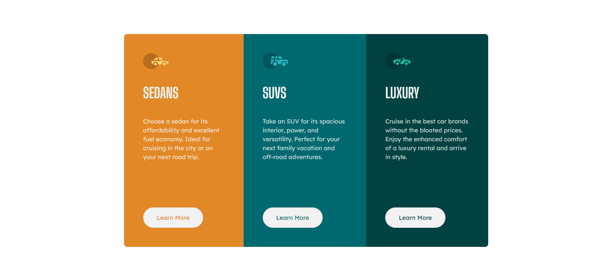
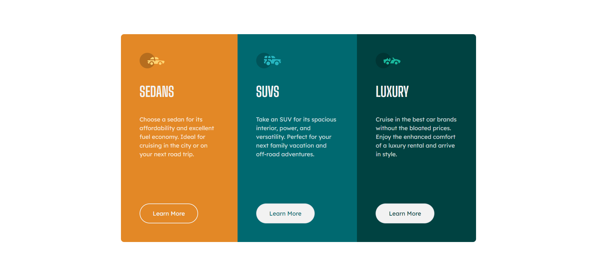

# Frontend Mentor - 3-column preview card component solution

This is a solution to the [3-column preview card component challenge on Frontend Mentor](https://www.frontendmentor.io/challenges/3column-preview-card-component-pH92eAR2-). Frontend Mentor challenges help you improve your coding skills by building realistic projects. 

## Table of contents

- [Overview](#overview)
  - [The challenge](#the-challenge)
  - [Screenshot](#screenshot)
  - [Links](#links)
- [My process](#my-process)
  - [Built with](#built-with)
  - [What I learned](#what-i-learned)
- [Author](#author)

## Overview

### The challenge

Users should be able to:

- View the optimal layout depending on their device's screen size
- See hover states for interactive elements

### Screenshot

- desktop

- hover button

### Links

- Live Site URL: [here](https://3-column-preview-card-component-solution-six.vercel.app/)

## My process

### Built with

- Semantic HTML5 markup
- CSS custom properties
- Flexbox
- Mobile-first workflow
- [Next.js](https://nextjs.org/) - React framework
- [tailwind](https://tailwindcss.com/) - CSS framework

### What I learned

I just started tailwind, maybe I have my code messy

### Continued development

Practicing tailwind more and more

## Author

- Github - [here](https://www.github.com/fiqihalfito)
- LinkedIn - [fiqih-alfito](https://www.linkedin.com/in/fiqih-alfito)
